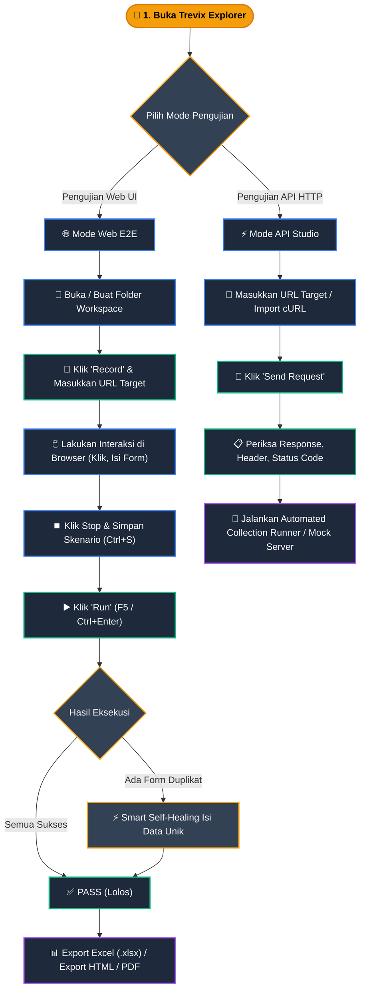

# 📘 Trevix Explorer — Official Manual Book

> **Platform**: Windows 10 / 11 (Installer resmi saat ini hanya untuk Windows 10/11)  
> **Repository**: [https://github.com/RaffiDevYT/trevix-explorer-releases](https://github.com/RaffiDevYT/trevix-explorer-releases)  
> **Lisensi**: Proprietary - lihat berkas LICENSE

---

## 📑 Daftar Isi

1. [Tentang Trevix Explorer](#1-tentang-trevix-explorer)
2. [Arsitektur & Teknologi](#2-arsitektur--teknologi)
3. [Panduan Instalasi & Update](#3-panduan-instalasi--update)
4. [Daftar Fitur Utama](#4-daftar-fitur-utama)
   - [A. Manajemen Project & Workspace](#a-manajemen-project--workspace)
   - [B. Smart Multi-Frame Test Recorder](#b-smart-multi-frame-test-recorder)
   - [C. Visual Test Editor & Multi-View](#c-visual-test-editor--multi-view)
   - [D. Real-time Test Runner & Console Logger](#d-real-time-test-runner--console-logger)
   - [E. Test Scenario Matrix & Export (Excel & HTML)](#e-test-scenario-matrix--export-excel--html)
   - [F. Sistem Auto-Updater Terintegrasi](#f-sistem-auto-updater-terintegrasi)
   - [G. Trevix API Studio & Testing](#g-trevix-api-studio--testing)
   - [H. Automated API Collection Runner](#h-automated-api-collection-runner)
   - [I. Local API Mock Server & Dynamic Interpolation](#i-local-api-mock-server--dynamic-interpolation)
   - [J. Quick Command Palette](#j-quick-command-palette-ctrl--k--cmd--k)
   - [K. Daftar Pintasan Keyboard](#k-daftar-pintasan-keyboard-keyboard-shortcuts)
5. [Tabel Referensi Lengkap Action Steps](#5-tabel-referensi-lengkap-action-steps)
6. [Daftar Variabel Dinamis](#6-daftar-variabel-dinamis)
7. [Mekanisme & Perilaku Pengujian](#7-mekanisme--perilaku-pengujian)
   - [A. Asersi Cerdas, Polling & Mode Pencocokan URL](#a-asersi-cerdas-polling--mode-pencocokan-url)
   - [B. Unggah Berkas & Fallback Dummy](#b-unggah-berkas--fallback-dummy)
   - [C. Pemilihan Dropdown (Select & Select2)](#c-pemilihan-dropdown-select--select2)
   - [D. Pengendalian Popup & Tab Baru](#d-pengendalian-popup--tab-baru)
   - [E. Deteksi, Penyamaran Nilai Rahasia & Variabel Lingkungan](#e-deteksi-penyamaran-nilai-rahasia--variabel-lingkungan)
   - [F. Keamanan Mock Server & Kebijakan CORS](#f-keamanan-mock-server--kebijakan-cors)
   - [G. Penyimpanan Request API di Workspace](#g-penyimpanan-request-api-di-workspace)
   - [H. Jembatan Salin Clipboard di Proses Utama](#h-jembatan-salin-clipboard-di-proses-utama)
8. [Smart Self-Healing](#8-smart-self-healing)
9. [Format Standar File Pengujian (.spec.json)](#9-format-standar-file-pengujian-specjson)
10. [Struktur Folder & File Output](#10-struktur-folder--file-output)
11. [Panduan Alur Penggunaan (Step-by-Step)](#11-panduan-alur-penggunaan-step-by-step)
12. [Batasan Sistem (Known Limitations)](#12-batasan-sistem-known-limitations)
13. [Kebijakan Keamanan & Privasi](#13-kebijakan-keamanan--privasi)
14. [Troubleshooting & FAQ](#14-troubleshooting--faq)

---

## 1. Tentang Trevix Explorer

**Trevix Explorer** adalah aplikasi desktop visual yang dirancang khusus untuk kebutuhan **Visual End-to-End (E2E) Test Automation**, **API Testing**, dan **Dokumentasi Matriks QA**.

Aplikasi ini memungkinkan QA Engineer, Software Tester, dan Developer untuk:

- Merekam alur pengujian web secara interaktif tanpa harus menulis baris kode dari awal (_No-Code Recording_).
- Menyesuaikan, menyusun ulang, dan menambahkan assertion/validasi pada setiap langkah pengujian secara visual.
- Mengonversi skenario pengujian ke skrip native **Playwright TypeScript (`.spec.ts`)** yang siap dijalankan mandiri.
- Menguji API REST/HTTP, menjalankan Automated Collection Runner, dan menjalankan Local Mock Server.
- Menghasilkan laporan matriks pengujian dalam format **Microsoft Excel (`.xlsx`)** dan laporan interaktif **HTML Standalone** siap serah terima ke tim bisnis maupun klien.

---

## 2. Arsitektur & Teknologi

Dibangun dengan Electron dan Playwright.

---

## 3. Panduan Instalasi & Update

### A. Instalasi Baru

1. Unduh installer resmi dari halaman [GitHub Releases](https://github.com/RaffiDevYT/trevix-explorer-releases/releases).
2. Jalankan file installer (installer resmi saat ini hanya untuk Windows 10/11):
   - **Windows**: `trevix-explorer-<versi>-setup.exe` atau extract file portable `.zip`.
3. Ikuti wizard instalasi hingga selesai dan buka aplikasi.

### B. Pembaruan Otomatis (Auto-Update)

1. Saat rilis baru tersedia di GitHub Releases, indikator pembaruan di header aplikasi akan menyala.
2. Klik tombol pembaruan untuk melihat catatan rilis (_Release Notes_) dan memulai pengunduhan di latar belakang.
3. Setelah selesai, klik **"Update & Restart"** untuk memasang versi terbaru.

---

## 4. Daftar Fitur Utama

```text
┌─────────────────────────────────────────────────────────────────────────┐
│                           TREVIX EXPLORER UI                            │
├──────────────┬──────────────────────────────────────────┬───────────────┤
│  SIDEBAR     │            TOOLBAR & TAB BAR             │  MATRIX PANEL │
│ ──────────── │ ──────────────────────────────────────── │ ───────────── │
│ • Workspace  │ [▶ Run] [⏺ Record] [Browser: Chrome ▼]   │ Module: Auth │
│ • Test Files │                                          │ Tipe: Positive│
│   - login    │ ┌──────────────────────────────────────┐ │ Remark: PASS  │
│   - checkout │ │ Tab: login.spec.json(Visual|Scenario)│ │ Tester: QA    │
│ • API Studio │ └──────────────────────────────────────┘ │ [Export XLSX] │
└──────────────┴──────────────────────────────────────────┴───────────────┘
```

### A. Manajemen Project & Workspace

- **Folder Isolasi Otomatis**: Saat membuat project baru, aplikasi otomatis menyiapkan struktur folder `tests/`, `apis/`, dan `reports/`.
- **Kunci Workspace (`.trevix.lock`)**: File pengunci sesi aktif untuk melindungi workspace saat aplikasi berjalan.
- **Recent Projects**: Riwayat folder proyek terakhir untuk mempermudah perpindahan ruang kerja.
- **Menu Aksi File**:
  - 📥 **Download (.spec.json)**: Menyimpan salinan berkas spesifikasi ke lokasi lain.
  - 📑 **Duplicate**: Menduplikasi skenario pengujian secara instan.
  - ✏️ **Rename**: Mengubah nama berkas dan skenario pengujian.
  - 🗑️ **Delete**: Menghapus berkas skenario dari penyimpanan.

### B. Smart Multi-Frame Test Recorder

- **One-Click Record**: Cukup masukkan URL target dan pilih browser engine (Chromium, Google Chrome, Microsoft Edge, Firefox, Brave).
- **Multi-Frame & Iframe Support**: Merekam interaksi pengguna di seluruh frame dan iframes web secara transparan.
- **Smart Locator Generator**: Menghasilkan selector yang stabil dan tahan terhadap perubahan DOM:
  $$\text{ID} \rightarrow \text{data-testid / data-cy} \rightarrow \text{name} \rightarrow \text{text-selector} \rightarrow \text{Hierarchy CSS}$$
- **Proteksi Anti-Popup**: Memblokir script iklan, popunder, dan tab jebakan yang tidak diizinkan selama perekaman.
- **Auto Secret Masking**: Otomatis mendeteksi input kata sandi/kredensial dan menyamarkan nilainya (`••••••`).

### C. Visual Test Editor & Multi-View

1. **Visual**: Tabel langkah pengujian interaktif dengan dukungan inline-edit, reordering, toggle aktif/nonaktif, dan penambahan aksi kustom melalui tombol **"+ Step"** di toolbar yang membuka dialog **"Add Step Manually"**.
2. **Script**: Pratinjau kode native Playwright TypeScript yang di-generate secara real-time dengan editor Monaco.
3. **Scenario**: Panel pengisian metadata dokumentasi QA (Module, Feature, Scenario Type, Priority, Precondition, Detail, Tester, Expected Output, Actual Result, dan Remark).

### D. Real-time Test Runner & Console Logger

- **Live Progress Beacon**: Indikator warna langkah secara _real-time_ (Abu-abu: Pending, Biru: Running, Hijau: Passed, Merah: Failed).
- **Auto-Screenshot on Failure**: Tangkapan layar otomatis diambil saat terjadi kegagalan dan disimpan ke `reports/fail_step<id>_<timestamp>.png`.
- **Resizable Console Panel**: Memantau output log eksekusi runner Playwright secara langsung.

### E. Test Scenario Matrix & Export (Excel & HTML)

- **Generate from Steps**: Menyusun narasi langkah pengujian terstruktur secara otomatis dari deretan aksi.
- **Export Excel (.xlsx)**: Menghasilkan dokumen Excel dengan styling rapi, header Dark Navy (`#1E293B`), text-wrapping, border slate, dan pewarnaan otomatis pada kolom Remark.
- **Export HTML / PDF**: Laporan mandiri berdesain modern (Dark/Light mode toggle, KPI dashboard, filter interaktif, pencarian real-time, dan format siap cetak PDF).

### F. Sistem Auto-Updater Terintegrasi

- Terhubung dengan GitHub Releases via protokol HTTPS.
- Mengunduh pembaruan di latar belakang tanpa menghentikan pekerjaan pengujian yang sedang berjalan.

### G. Trevix API Studio & Testing

- **HTTP Methods Lengkap**: Mendukung `GET`, `POST`, `PUT`, `PATCH`, `DELETE`, `OPTIONS`, `HEAD`.
- **Parameter & Body Builder**:
  - **Query Params**: Key-value query parameters dengan auto-encode URL.
  - **Headers**: Custom HTTP headers dengan status aktif/nonaktif per baris.
  - **Auth**: None, Bearer Token, Basic Auth, API Key (Header/Query).
  - **Body Format**: JSON, Form Data (Text & File Upload), x-www-form-urlencoded, Raw.
- **Environment & Dynamic Variables**: Substitusi variabel otomatis (`{{baseUrl}}`, `{{$randomEmail}}`, dsb).
- **Response Inspector**: Tampilan JSON terstruktur, Raw, Headers, Cookies, Status Code, Latency (ms), dan Response Size.
- **Import & Export**:
  - **cURL Parser**: Paste perintah cURL untuk langsung dikonversi menjadi request siap uji.
  - **Code Generator**: Ekspor request ke berbagai bahasa (cURL, JavaScript Fetch, Axios, Python Requests, PHP cURL, Go HTTP, Java OkHttp, Node.js).
  - **Postman & OpenAPI Import/Export**: Mendukung import berkas Postman Collection v2.1 dan OpenAPI 3.0.

### H. Automated API Collection Runner

- **Automated Multi-Request Execution**: Menjalankan seluruh request dalam folder/koleksi secara sekuensial.
- **Iteration & Delay Simulation**: Mendukung pengulangan eksekusi berkali-kali dengan jeda waktu penundaan (ms).
- **Live Summary Report**: Menampilkan visualisasi status PASS vs FAIL, total durasi, rata-rata response time, dan log kegagalan tiap asersi.

### I. Local API Mock Server & Dynamic Interpolation

- **Built-in Mock Server**: Menjalankan server mock lokal (default port `4010`) tanpa dependensi eksternal.
- **Zero Restart / Live Reload**: Perubahan konfigurasi rute, response body, atau headers langsung aktif secara real-time.
- **Dynamic Path Parameter & Generators**: Mendukung `{{params.id}}`, `{{query.search}}`, `{{uuid}}`, `{{timestamp}}`, `{{randomName}}`, `{{randomEmail}}`, `{{randomInt}}`.
- **Custom Status & Artificial Latency**: Simulasi latency jaringan (`delayMs`) dan HTTP status code (`200`, `201`, `400`, `404`, `500`).
- **Real-time Request Log Inspector**: Menangkap dan menampilkan traffic log request yang masuk secara langsung.

### J. Quick Command Palette (`Ctrl + K` / `Cmd + K`)

- Jendela pencarian terpusat untuk membuka skenario pengujian (`.spec.json`), request API, beralih mode kerja, atau menjalankan aksi cepat (`F5`, `Ctrl+R`, Mock Server, Export).

### K. Daftar Pintasan Keyboard (Keyboard Shortcuts)

| Shortcut               | Aksi / Fungsi                                         |
| :--------------------- | :---------------------------------------------------- |
| `Ctrl + K` / `Cmd + K` | Membuka Quick Command Palette universal               |
| `Ctrl + B` / `Cmd + B` | Menampilkan atau menyembunyikan sidebar (Toggle Sidebar)|
| `Ctrl + Enter` / `F5`  | Menjalankan (_Run_) skenario test aktif               |
| `Ctrl + R`             | Membuka dialog / mulai perekaman (_Record_)           |
| `Ctrl + S`             | Menyimpan berkas skenario test atau request API aktif (_Save_) |
| `Ctrl + T` / `Ctrl + N`| Membuka tab pengujian atau request API baru           |
| `Ctrl + W`             | Menutup tab aktif                                     |
| `F2`                   | Mengubah nama berkas test aktif (_Rename_)            |
| `Esc`                  | Menutup dialog modal / Command Palette                |

---

## 5. Tabel Referensi Lengkap Action Steps

Berikut adalah seluruh aksi langkah pengujian yang didukung oleh mesin pengujian (test runner):

| Nama Action         | Target Element (`targetObjectId`) | Parameter yang Didukung                                                                                                                                                                                | Nilai Bawaan (Default)                                               | Contoh JSON Step                                                                                                                        |
| :------------------ | :-------------------------------- | :----------------------------------------------------------------------------------------------------------------------------------------------------------------------------------------------------- | :------------------------------------------------------------------- | :-------------------------------------------------------------------------------------------------------------------------------------- |
| `navigate`          | Opsional (URL)                    | `url` (string)                                                                                                                                                                                         | `""`                                                                 | `{"action": "navigate", "parameters": {"url": "https://example.com/login"}}`                                                            |
| `click`             | Selector CSS / XPath / Text       | `allowPopup` (boolean)                                                                                                                                                                                 | `false`                                                              | `{"action": "click", "targetObjectId": "#submit-btn", "parameters": {"allowPopup": false}}`                                             |
| `fill`              | Selector Input / Form             | `text` (string)<br>`isSecret` (boolean)<br>`envName` (string, opsional)<br>`allowDummyFile` (boolean)                                                                                                  | `text: ""` <br>`isSecret: false`<br>`allowDummyFile: false`          | `{"action": "fill", "targetObjectId": "#userPassword", "parameters": {"text": "mypassword123", "isSecret": true}}`                      |
| `select`            | Selector `<select>` / Select2     | `value` (string)<br>`label` (string)<br>`text` (string)                                                                                                                                                | `""`                                                                 | `{"action": "select", "targetObjectId": "#dropdown-role", "parameters": {"label": "Administrator"}}`                                    |
| `assert`            | Selector Elemen Target            | `assertType` (`toBeVisible`, `toBeHidden`, `toHaveText`, `toContainText`, `toHaveValue`, `toBeEnabled`, `toBeDisabled`, `toHaveURL`)<br>`value` (string)<br>`matchMode` (`exact`, `contains`, `regex`) | `assertType: "toBeVisible"`<br>`value: ""`                           | `{"action": "assert", "targetObjectId": "#success-alert", "parameters": {"assertType": "toHaveText", "value": "Berhasil disimpan"}}`    |
| `wait`              | Tidak ada                         | `ms` (string / number)                                                                                                                                                                                 | `1000`                                                               | `{"action": "wait", "parameters": {"ms": 2000}}`                                                                                        |
| `screenshot`        | Tidak ada                         | `filename` (string)                                                                                                                                                                                    | `screenshot_<timestamp>.png`                                         | `{"action": "screenshot", "parameters": {"filename": "dashboard_view.png"}}`                                                            |
| `upload_file`       | Selector `<input type="file">`    | `filePath` / `path` / `file` / `value` / `text` (string)<br>`allowDummyFile` (boolean)                                                                                                                 | `allowDummyFile: false`                                              | `{"action": "upload_file", "targetObjectId": "input[name='avatar']", "parameters": {"filePath": "avatar.png", "allowDummyFile": true}}` |
| `api_request`       | Tidak ada                         | `method` (`GET`, `POST`, `PUT`, `PATCH`, `DELETE`)<br>`url` (string)<br>`body` (string / JSON)<br>`headers` (object)<br>`expectedStatus` (string)                                                      | `method: "GET"`<br>`expectedStatus: "200"` (atau `"201"` untuk POST) | `{"action": "api_request", "parameters": {"method": "POST", "url": "https://api.example.com/data", "expectedStatus": "201"}}`           |
| `assert_snapshot`   | Selector Elemen (Opsional)        | `snapshotName` (string)                                                                                                                                                                                | `<step_id>.png`                                                      | `{"action": "assert_snapshot", "targetObjectId": "#main-chart", "parameters": {"snapshotName": "chart_baseline.png"}}`                  |
| `audit_performance` | Tidak ada                         | `maxLoadTimeMs` (string / number, opsional SLA threshold)                                                                                                                                              | Tidak ada threshold                                                  | `{"action": "audit_performance", "parameters": {"maxLoadTimeMs": 3000}}`                                                                |

> 📌 **Catatan Khusus `assert`**: Parameter `matchMode` (`exact`, `contains`, `regex`) **hanya berlaku untuk `assertType: "toHaveURL"`**. Untuk tipe asersi lainnya, evaluasi teks dilakukan dengan polling retry 8 detik dan normalisasi spasi standar.

---

## 6. Daftar Variabel Dinamis

Mesin pengujian mendukung variabel dinamis yang dapat disisipkan pada input teks langkah `fill`, URL, dan body request API:

| Variabel           | Sintaks Alternatif | Output yang Dihasilkan                                | Contoh Hasil                                  |
| :----------------- | :----------------- | :---------------------------------------------------- | :-------------------------------------------- |
| `{{$timestamp}}`   | `$timestamp`       | Angka timestamp epoch saat ini (`Date.now()`).        | `1728123456789`                               |
| `{{$randomEmail}}` | `$randomEmail`     | Alamat email acak unik berbasis timestamp.            | `auto_456789_k8a9f@test.com`                  |
| `{{$randomUUID}}`  | `$randomUUID`      | Format string UUID v4 unik (`crypto.randomUUID()`).   | `c9a1e4b2-7f28-4a11-89dc-0123456789ab`        |
| `{{$randomPhone}}` | `$randomPhone`     | Nomor telepon seluler Indonesia dummy berawalan `08`. | `081234567890`                                |
| `{{$randomInt}}`   | `$randomInt`       | Angka integer acak 4–5 digit (`1000` s/d `90999`).    | `48291`                                       |
| `{{$randomName}}`  | `$randomName`      | Kombinasi nama depan dan belakang Indonesia acak.     | `Budi Pratama`, `Siti Kusuma`, `Rafi Saputra` |

---

## 7. Mekanisme & Perilaku Pengujian

### A. Asersi Cerdas, Polling & Mode Pencocokan URL

- **Polling 8 Detik**: Asersi teks (`toHaveText`, `toContainText`, `toHaveValue`) melakukan pemeriksaan berulang selama 8 detik dengan jeda 200ms. Ini mengeliminasi kegagalan semu pada aplikasi SPA/React yang merender teks secara asinkron.
- **Normalisasi Spasi**: Spasi ganda, newline, dan tab dinormalisasi menjadi spasi tunggal (`replace(/\s+/g, ' ').trim()`) pada `toHaveText` dan `toContainText`. Sedangkan asersi `toHaveValue` tidak menormalkan spasi agar nilai input form dapat dievaluasi secara presisi.
- **Mode Pencocokan URL (`toHaveURL`)**:
  - `exact`: Memeriksa apakah `url.href` atau `pathname + search + hash` persis sama dengan nilai target.
  - `contains`: Memeriksa apakah URL memuat substring target.
  - `regex`: Memeriksa kecocokan URL menggunakan ekspresi reguler.
  - _Legacy Fallback_: Skenario lama tanpa parameter `matchMode` akan dievaluasi dengan mode contains atau regex otomatis.

### B. Unggah Berkas & Fallback Dummy

- Saat langkah `upload_file` (atau `fill` pada elemen input file) dijalankan, runner mencari berkas target di daftar lokasi kandidat: path asli, folder `reports/`, folder `tests/`, root proyek, folder `Downloads/`, `Desktop/`, dan `Documents/`.
- **Kegagalan Eksplisit**: Jika berkas tidak ditemukan di semua lokasi kandidat, langkah akan **gagal** dengan pesan error yang mendaftar seluruh path yang diperiksa.
- **Dummy Fallback**: Jika parameter `allowDummyFile: true` diaktifkan, runner otomatis membuat file sampel tiruan di folder `reports/` dan melanjutkan pengujian disertai log peringatan (_warning_).

### C. Pemilihan Dropdown (Select & Select2)

- Runner mendukung dropdown HTML standar `<select>` serta widget pencarian **Select2 (jQuery)**.
- Algoritma mencoba pencocokan via label teks terlebih dahulu, kemudian nilai atribut `value`, dan terakhir simulasi klik visual pada kontainer opsi.
- Jika opsi tidak ditemukan setelah seluruh strategi dicoba, langkah akan gagal dengan pesan error deskriptif.

### D. Pengendalian Popup & Tab Baru

- **Anti-Popup Bawaan**: Secara default, seluruh popunder, link `target="_blank"`, dan pemanggilan popup baru otomatis diblokir dan ditutup oleh sistem pengaman popup (baik pada level halaman aktif maupun browser context).
- **Opsi "Buka Tab Baru" (`allowPopup: true`)**: Jika sebuah tombol atau link memang ditujukan untuk membuka tab baru, centang opsi "Buka tab baru" pada langkah `click`.
- **Perpindahan Tab Otomatis**: Runner otomatis mendeteksi tab baru yang diizinkan, memindahkan fokus ke tab tersebut, dan menjalankan langkah-langkah berikutnya di sana.
- **Kembali ke Tab Terakhir**: Jika tab aktif ditutup, runner otomatis kembali ke tab terakhir yang masih terbuka di dalam sesi browser.

### E. Deteksi, Penyamaran Nilai Rahasia & Variabel Lingkungan

- **Deteksi Otomatis & Lokasi Opsi "Rahasia"**:
  - **Deteksi Otomatis**: Input bertipe `password` saat perekaman, atau selector yang memuat kata kunci (`password`, `passwd`, `pwd`, `passwrd`, `passcode`, `passphrase`, `passkey`, `sandi`, `katasandi`, `token`, `secret`, `apikey`, `api_key`) otomatis mengaktifkan `isSecret: true`.
  - **Aturan Kata "pass" & Pengecualian**: Field dengan selector/nama yang berakhiran "pass" (mis. `#userpass`, `#txtpass`) serta kata utuh "pass" (mis. `#pass`) juga otomatis dianggap rahasia. Kata-kata umum seperti `passport`, `bypass`, `compass`, `passenger`, `passage`, `passthrough`, `secretary`, dan `tokenizer` sengaja dikecualikan guna mencegah *false positive*.
  - **Lokasi Checkbox "Rahasia"**: Opsi rahasia dapat diatur secara manual melalui checkbox **"Rahasia"** pada baris tabel langkah mode Visual, atau melalui checkbox **"Rahasia (sembunyikan nilai di log dan ekspor ke env)"** pada konfigurasi aksi `fill` di dialog modal **"Add Step Manually"**.
- **Penyamaran Nilai (`••••••`)**: Seluruh nilai rahasia disamarkan menjadi `••••••` pada UI visual, pratinjau live Scenario Matrix, metadata `stepsDescription`, kolom `INPUT` ekspor Excel, tabel laporan HTML, dan log Smart Self-Healing.
- **Ekspor Variabel Lingkungan**:
  - Kode Playwright mengekspor input rahasia menggunakan variabel lingkungan (`process.env.AUTH_...`) dengan nama turunan selector yang deskriptif (`AUTH_PASSWORD`, `AUTH_USER_PASSWORD`).
  - Variabel lokal hasil translasi selalu berawalan aman `auth` (mis. `const authUserPassword = process.env["AUTH_USER_PASSWORD"];`) sehingga tidak menimpa variabel bawaan seperti `page` atau `expect`.
  - Skrip ekspor melempar runtime error `Env ... belum diisi` jika variabel lingkungan tidak diset.
  - Menjalankan skrip ekspor di PowerShell:
    ```powershell
    $env:AUTH_USER_PASSWORD="password_asli"
    npx playwright test
    ```
- > ⚠️ **PERINGATAN KEAMANAN**: Berkas `.spec.json` menyimpan nilai teks apa adanya di dalam properti `parameters.text` agar engine runner lokal dapat mengeksekusi otomatisasi browser. **Jangan pernah meng-commit berkas `.spec.json` yang berisi kata sandi sensitif/asli ke repositori publik. Selalu gunakan akun uji khusus (testing/staging account).**

### F. Keamanan Mock Server & Kebijakan CORS

- Server mock lokal mengikat secara ketat pada antarmuka loopback `127.0.0.1` (tidak membuka port ke `0.0.0.0` atau jaringan luar).
- Header `Access-Control-Allow-Origin: *` diaktifkan secara khusus agar aplikasi web lokal yang sedang diuji pada port sembarang (mis. `localhost:3000`, `localhost:5173`) dapat mengakses rute mock tanpa kendala CORS browser.
- ⚠️ **Peringatan Keamanan Mock Server**: Konfigurasi CORS `Access-Control-Allow-Origin: *` membuat situs web mana pun yang dibuka di browser biasa dapat memanggil endpoint mock server lokal selama server mock sedang berjalan.

### G. Penyimpanan Request API di Workspace

- Request API disimpan dalam berkas individu di folder `apis/<nama_request>.api.json`.
- Nama berkas diturunkan dari nama request yang dinormalisasi ke huruf kecil. **Jika dua request memiliki nama yang sama, berkas yang disimpan sebelumnya akan ditimpa.**

### H. Jembatan Salin Clipboard di Proses Utama

- Seluruh tombol salin (Copy Code, Copy Response, Copy Snippet, Copy Mock URL) diproses melalui proses utama aplikasi untuk menjamin keandalan penyalinan di sistem operasi desktop.

---

## 8. Smart Self-Healing

Saat form web menolak data duplikat setelah pengiriman (*submit*), Trevix Explorer secara otomatis mendeteksi pesan penolakan validasi dari respon server atau tampilan halaman (seperti `already taken`, `must be unique`, `sudah terdaftar`, `data ganda`, `tidak boleh sama`), menghasilkan nilai unik baru (email, nomor telepon, angka, nama acak), mengisi ulang kolom formulir yang bersangkutan, dan mengulang klik tombol submit secara otomatis.

Fitur Smart Self-Healing ini dapat dinonaktifkan jika Anda sedang menjalankan pengujian negatif (*negative testing*) untuk memvalidasi penolakan data duplikat.

---

## 9. Format Standar File Pengujian (`.spec.json`)

Contoh struktur berkas spesifikasi `.spec.json`:

```json
{
  "name": "login_admin",
  "metadata": {
    "no": "1.",
    "module": "Authentication",
    "feature": "Login Admin",
    "scenarioType": "Positive",
    "scenario": "1.1. Login dengan kredensial valid",
    "priority": "High",
    "detail": "Pengujian login admin menggunakan email dan password terdaftar",
    "precondition": "Akun admin aktif di database staging",
    "stepsDescription": "1. Navigate to \"https://example.com/login\"\n2. Enter text \"admin@example.com\" into \"#email\"\n3. Enter text \"••••••\" into \"#password\"\n4. Click on element \"Masuk\"",
    "tester": "QA Automation Lead",
    "expectedOutput": "Berhasil masuk ke Dashboard Admin",
    "actualResult": "Executed successfully as expected",
    "remark": "PASS"
  },
  "steps": [
    {
      "id": "step-1",
      "action": "navigate",
      "parameters": {
        "url": "https://example.com/login"
      },
      "enabled": true
    },
    {
      "id": "step-2",
      "action": "fill",
      "targetObjectId": "#email",
      "parameters": {
        "text": "admin@example.com"
      },
      "enabled": true
    },
    {
      "id": "step-3",
      "action": "fill",
      "targetObjectId": "#password",
      "parameters": {
        "text": "secret123",
        "isSecret": true
      },
      "enabled": true
    },
    {
      "id": "step-4",
      "action": "click",
      "targetObjectId": "button:has-text('Masuk')",
      "parameters": {
        "allowPopup": false
      },
      "enabled": true
    },
    {
      "id": "step-5",
      "action": "assert",
      "targetObjectId": "#dashboard-title",
      "parameters": {
        "assertType": "toBeVisible"
      },
      "enabled": true
    }
  ]
}
```

---

## 10. Struktur Folder & File Output

Folder proyek Trevix Explorer memiliki struktur direktori sebagai berikut:

```text
📁 My_Test_Project/
│
├── 🔒 .trevix.lock           # File pengunci sesi aktif (otomatis saat workspace dibuka)
│
├── 📁 tests/                  # Direktori file skenario pengujian UI E2E
│   ├── login_admin.spec.json  # Spesifikasi visual & metadata matriks
│   ├── checkout.spec.json
│   └── register.spec.json
│
├── 📁 apis/                   # Direktori request tersimpan API Studio
│   ├── login_user.api.json    # Berkas request API berformat JSON
│   └── get_products.api.json
│
└── 📁 reports/                # Direktori bukti pengujian, screenshot & ekspor
    ├── screenshots/           # Tangkapan layar otomatis saat asersi/kegagalan
    ├── fail_step3_172891.png
    └── Test_Scenario_Matrix.xlsx # Berkas ekspor matriks Excel
```

---

## 11. Panduan Alur Penggunaan (Step-by-Step)



---

## 12. Batasan Sistem (Known Limitations)

Berikut adalah batasan teknis yang perlu diperhatikan saat merancang pengujian:

1. **Pemeriksaan Status HTTP Navigasi**: Aksi `navigate` tidak memvalidasi status HTTP response (halaman yang mengembalikan response code 404 Not Found atau 500 Internal Server Error tetap dianggap berhasil selama proses navigasi browser selesai). Gunakan aksi `assert` untuk memvalidasi elemen penanda di halaman.
2. **Asersi Status Elemen Tanpa Polling**: Asersi `toBeEnabled` dan `toBeDisabled` dievaluasi secara instan satu kali tanpa mekanisme retry polling 8 detik.
3. **Aksi yang Belum Didukung**: Engine saat ini belum menyediakan aksi khusus untuk _mouse hover_, penekanan tombol keyboard manual (_press key_), _drag-and-drop_ antar elemen, serta perpindahan tab manual tanpa pemicu event klik.
4. **Format Ekspor Kode**: Generator kode ekspor hanya mendukung Playwright native (tidak ada opsi ekspor ke Selenium, Cypress, atau framework lain).
5. **Penyimpanan Sesi / State**: Belum mendukung penyimpanan otomatis `storageState` untuk penggunaan ulang sesi login antar-file pengujian.
6. **Eksekusi Sekuensial**: Runner E2E menjalankan satu berkas skenario per waktu (belum mendukung eksekusi batch paralel multi-file untuk skenario UI).
7. **Target Teks Polos pada Skrip Ekspor**: Target selector yang hanya berupa teks murni (mis. `"Simpan"`) akan diekspor sebagai `page.locator("Simpan")` (yang mencari tag HTML `<simpan>` pada Playwright murni). Gunakan format `text="Simpan"` agar diekspor sebagai `page.getByText("Simpan")`. Target yang diselesaikan lewat heuristik runtime runner mungkin memerlukan penyesuaian pada skrip ekspor.
8. **Format Nilai Acak pada Skrip Ekspor Playwright**: Skrip ekspor Playwright mengevaluasi template variabel dinamis di sisi klien dengan format nilai acak yang berbeda dari runner internal:
   - `$randomEmail`: `'auto_' + Date.now() + '@test.com'` (pola `auto_<Date.now()>@test.com`, sedangkan runner internal menghasilkan `auto_<6 digit timestamp>_<5 karakter acak>@test.com`).
   - `$randomUUID`: `Math.random().toString(36).substring(2)` (sedangkan runner internal menggunakan `crypto.randomUUID()`).
   - `$randomName`: `'User_' + Date.now().toString().slice(-4)` (pola `User_<4 digit>`, sedangkan runner internal menggabungkan nama depan dan belakang Indonesia acak dari daftar kamus).
   - `$randomPhone`: `'08' + Math.floor(100000000 + Math.random() * 900000000)` (sama persis dengan runner).
   - `$randomInt`: `Math.floor(1000 + Math.random() * 90000)` (rentang `1000` s/d `90999`, sama persis dengan runner).
9. **Pengujian Berbasis Data (Data-Driven Testing)**: Pengujian berbasis data (seperti iterasi satu skenario pengujian dengan banyak baris data dari berkas CSV atau Excel) belum didukung. Setiap skenario pengujian dijalankan satu per satu menggunakan nilai statis atau variabel dinamis acak.

---

## 13. Kebijakan Keamanan & Privasi

1. **Penyimpanan Lokal Penuh**: Seluruh berkas skenario (`tests/`), koleksi API (`apis/`), screenshot bukti uji (`reports/`), dan pengaturan workspace disimpan 100% di disk lokal komputer pengguna.
2. **Tanpa Telemetri**: Trevix Explorer tidak menyematkan pustaka analitik, pelacakan pengguna, atau pengiriman data telemetri ke server pihak ketiga.
3. **Koneksi Jaringan Terbatas**: Akses jaringan hanya dilakukan untuk:
   - Permintaan HTTP yang dieksekusi pengguna di API Studio / E2E Runner.
   - Pengecekan pembaruan aplikasi ke endpoint resmi GitHub Releases (`RaffiDevYT/trevix-explorer-releases`) melalui HTTPS.
4. **Isolasi Mock Server**: Server mock hanya mendengarkan koneksi lokal pada `127.0.0.1`.

---

## 14. Troubleshooting & FAQ

#### Q: Mengapa muncul error `Env AUTH_... belum diisi` saat menjalankan skrip ekspor di Playwright?

> **Solusi**: Skrip Playwright hasil ekspor mengamankan kata sandi dengan variabel lingkungan. Tentukan nilainya di terminal sebelum menjalankan:
>
> - PowerShell (Windows): `$env:AUTH_USER_PASSWORD="password_asli"; npx playwright test`
> - Bash / Command Line: `export AUTH_USER_PASSWORD="password_asli" && npx playwright test`

#### Q: Asersi URL gagal setelah mengklik tombol/link yang membuka tab baru?

> **Solusi**: Buka langkah `click` tersebut di Visual Editor, lalu centang opsi **"Buka tab baru"** (`allowPopup: true`). Tanpa opsi ini, proteksi anti-popup akan memblokir popup baru secara otomatis.

#### Q: Muncul error `Element "..." not found or text could not be read within timeout (last error: ...)` pada asersi teks?

> **Solusi**: Periksa kembali apakah selector elemen sudah benar dan teks target sudah tampil sebelum timeout 8 detik berakhir. Jika teks berupa sebagian kalimat, gunakan tipe asersi `toContainText` alih-alih `toHaveText`.

#### Q: Navigasi mengalami timeout 30 detik pada website tertentu?

> **Solusi**: Pastikan koneksi internet stabil dan website target dapat diakses secara normal. Jika server lambat, tambahkan langkah `wait` setelah navigasi.

#### Q: Browser pilihan tidak terdeteksi di dropdown?

> **Solusi**: Aplikasi mendeteksi Google Chrome, Microsoft Edge, Firefox, dan Brave di direktori instalasi standar sistem operasi (`Program Files`). Jika browser terpasang di lokasi kustom, gunakan opsi **Chromium (Bundled)** bawaan.

---

_© 2026 Trevix Explorer — Developed by Raffi Studio. Proprietary - lihat berkas LICENSE._
